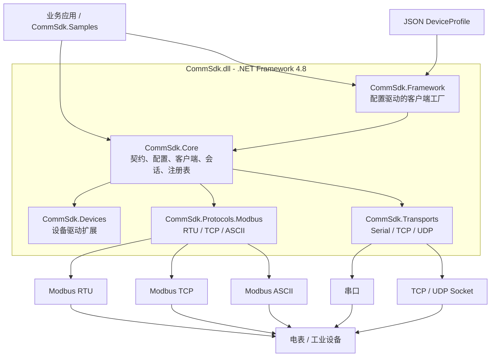

# CommSdk

CommSdk is a layered C# communication SDK targeting .NET Framework 4.8. It provides transport abstractions, serial/TCP/UDP transports, Modbus RTU/TCP/ASCII protocols, device-driver registration, JSON profiles, and synchronous/asynchronous request APIs.

## Projects

- `src/CommSdk/CommSdk.csproj`: the single framework library, output as `CommSdk.dll`.
- `src/CommSdk.Samples`: an independent executable usage example.
- `tests/CommSdk.Tests`: protocol, profile, framing, retry, and sample integration tests.

The framework is one assembly, while its source and public namespaces remain separated by responsibility:

- `CommSdk.Core`: contracts, profiles, registries, client, session lifecycle, and logging.
- `CommSdk.Transports`: serial, TCP, and UDP implementations.
- `CommSdk.Protocols.Modbus`: Modbus framing, CRC/LRC, validation, and factories.
- `CommSdk.Devices`: generic driver base class, reflection factory, and assembly loader.
- `CommSdk.Framework`: profile-based client factory.

## Architecture



请求流程为：业务应用加载 `DeviceProfile`，由 `CommSdk.Framework` 创建客户端；`CommSdk.Core` 负责请求生命周期和协议/传输协作，协议层完成报文编解码，传输层负责串口或 Socket 收发，最后访问现场设备。新增协议、传输或设备驱动时，只需在对应命名空间实现扩展接口并注册工厂。

## Build and test

Open `CommSdk.sln` in Visual Studio with .NET Framework 4.8 targeting support, or run:

```text
dotnet build CommSdk.sln --configuration Release
dotnet test CommSdk.sln
```

The target framework is `net48`; building the SDK on macOS requires a Windows/.NET Framework-compatible build environment for the final verification.

如果 Windows 上打开解决方案后显示 `0 of 3 projects` 或 `The project file was unloaded`，请使用 Visual Studio 2022，并在 Visual Studio Installer 中安装“使用 .NET 的桌面开发”、“.NET Framework 4.8 SDK”和“.NET Framework 4.8 Targeting Pack”。关闭解决方案后，在仓库根目录执行 `dotnet restore CommSdk.sln`，再重新打开 `CommSdk.sln`；如果项目节点仍是灰色，可右键解决方案或项目选择 `Reload Project`，然后查看 `View > Output > Project and Solution` 中的具体错误。若之前手动卸载过项目，请先关闭 Visual Studio，再删除仓库根目录下的 `.vs` 用户缓存目录后重开。仓库根目录的 `.vsconfig` 可用于导入所需组件。

## Register and use a device

```csharp
var profile = DeviceProfileJsonLoader.Load(File.ReadAllText("device-profile.json"));
var transports = new TransportRegistry();
transports.Register(new TcpTransportFactory());

var protocols = new ProtocolRegistry();
protocols.Register(new ModbusTcpProtocolFactory());

var drivers = new DriverRegistry();
drivers.Register(new MyDriverFactory());

using (var manager = new DeviceManager(transports, protocols, drivers))
using (var session = manager.Create(profile))
{
    session.Open();
    var result = session.Read(new DeviceCommand
    {
        Name = "readHoldingRegisters",
        Parameters = new Dictionary<string, string>
        {
            { "address", "0" },
            { "quantity", "2" }
        }
    });
}
```

`CommClient` serializes request/response operations, assembles protocol frames from transport chunks, validates Modbus transaction/slave/function identity, and retries transport failures according to `profile.retry`.

如果只使用本示例的电表客户端，不需要在业务代码中手动注册组件。`ElectricityMeterClient` 已经封装了串口/TCP、Modbus 和连接生命周期：

```csharp
using (var meter = ElectricityMeterClient.FromJsonFile("docs/examples/electricity-meter-profile.json"))
{
    meter.Open();
    var energy = meter.ReadEnergy();
    Console.WriteLine("累计电量: " + energy + " kWh");
}
```

只有在替换传输方式、协议或接入其他设备驱动时，才需要使用底层 `TransportRegistry`、`ProtocolRegistry` 和 `DriverRegistry`，这样 SDK 才能继续支持第三方扩展。

## Serial Modbus electricity meter example

`CommSdk.Samples` contains a complete serial Modbus RTU example for reading cumulative energy. The client sends a read-holding-registers request (`0x03`) and prints the decoded value in `kWh`:

```text
dotnet run --project src/CommSdk.Samples -- docs/examples/electricity-meter-profile.json
```

The profile uses `COM3`, 9600 8N1, slave address `1`, register address `0`, two registers, `UInt32BE`, and a `0.01` scale by default. Change the string values under `device.custom` in [electricity-meter-profile.json](/Users/tangjianhong/脚本/Communication/docs/examples/electricity-meter-profile.json) to match the meter manual. Modbus register addresses in this example are zero-based; some vendor manuals display one-based addresses such as `40001`, which must be converted before configuring `energyAddress`.

JSON 文件标准格式不支持注释，因此配置字段说明写在这里：`energyAddress` 是电量寄存器零基地址，`energyQuantity` 是读取的寄存器数量，`energyScale` 是原始值到 kWh 的倍率，`energyByteOrder` 是 32 位数值的字节序。串口参数位于 `transport`，Modbus 从站地址位于 `protocol.station`。

`ReadEnergy` returns a `double` in kWh. `energyFunction` may be set to `0x04` for input registers, and `energyByteOrder` supports `UInt32BE`, `UInt32LE`, `UInt32WordSwapBE`, and `UInt32WordSwapLE`. A call can override profile values when a device exposes more than one energy register:

```csharp
var energy = meter.ReadEnergy();
Console.WriteLine("累计电量: " + energy + " kWh");
```

串口示例需要真实串口适配器和能够响应配置寄存器的电表。如果电表使用 64 位数值、IEEE-754 浮点数、有符号数或厂商专用倍率，需要按电表寄存器表扩展客户端中的解析逻辑。

## TCP Modbus electricity meter example

TCP 电表使用相同的 `ElectricityMeterClient`，只需要将配置切换为 `tcp` 和 `modbus-tcp`：

```text
dotnet run --project src/CommSdk.Samples -- docs/examples/electricity-meter-tcp-profile.json
```

示例默认连接 `192.168.1.100:502`，从站地址为 `1`。请根据电表或串口服务器的实际 IP、端口和寄存器表修改 [electricity-meter-tcp-profile.json](/Users/tangjianhong/脚本/Communication/docs/examples/electricity-meter-tcp-profile.json)。TCP 协议会自动维护 Modbus MBAP 事务号，调用代码不需要手动设置。

## Extension points

Implement `ITransportFactory`, `IProtocolFactory`, or `IDeviceDriverFactory` and register the factory. A third-party driver assembly containing parameterless `IDeviceDriver` implementations can be loaded with `DeviceDriverAssemblyLoader.RegisterAll`.
