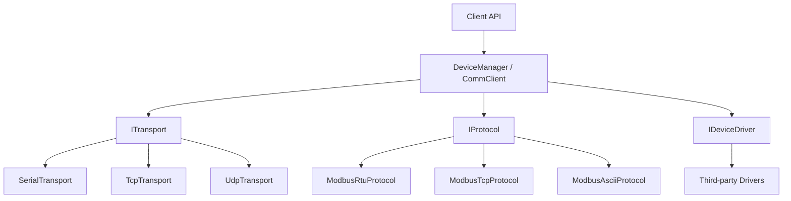

# C# 通用通信 SDK 技术方案（.NET Framework 4.x）

## 1. 背景与目标
本方案面向第三方集成，设计一个通用 C# 通信 SDK，统一串口与 Socket 通信、内置 Modbus（RTU/TCP/ASCII）协议，并支持快速扩展其他工业协议与设备驱动。目标强调：
- 统一抽象：传输、协议、设备驱动层清晰分离
- 可扩展性：第三方易于注册协议与设备驱动
- 易集成：配置驱动、文档友好、同步/异步并存
- 兼容性：.NET Framework 4.x

## 2. 非目标
- 不提供 NuGet 发布流程
- 不内置大量厂商私有协议（通过扩展实现）
- 不提供 UI 或上位机应用

## 3. 总体架构
分层设计：传输层、协议层、设备层。对外提供统一入口，屏蔽具体传输与协议差异。



## 4. 核心模块与职责
- 传输层：连接管理、收发、超时、重连、缓冲
- 协议层：帧编码/解码、校验、异常响应
- 设备层：设备能力封装，屏蔽寄存器/私有指令
- 管理层：多设备生命周期、配置加载、注册中心

## 5. 关键接口定义（草案）

### 5.1 ITransport
- `Open()` / `Close()` / `Send(byte[])` / `Receive()`
- `OpenAsync()` / `SendAsync()` / `ReceiveAsync()`
- 属性：`IsOpen`、`Timeout`、`BufferSize`

### 5.2 IProtocol
- `Encode(Request)` -> `byte[]`
- `Decode(byte[])` -> `Response`
- 支持请求/响应与事件上报

### 5.3 IDeviceDriver
- `Initialize(DeviceContext)`
- `Read(...)` / `Write(...)` / `Execute(...)`

### 5.4 注册中心
- `ITransportFactory` / `IProtocolFactory`
- `ProtocolRegistry.Register(type, factory)`
- `DriverRegistry.Register(model, factory)`

## 6. 数据流与配置

### 6.1 数据流
1. 加载 `DeviceProfile`
2. 创建 `ITransport`
3. 绑定 `IProtocol`
4. 装配 `IDeviceDriver`
5. 对外提供统一调用

### 6.2 配置结构（示例）
```json
{
  "device": {"model": "INV-100", "driver": "InverterDriver"},
  "transport": {"type": "serial", "port": "COM3", "baud": 9600},
  "protocol": {"type": "modbus-rtu", "station": 1, "endianness": "LE"},
  "retry": {"count": 3, "timeoutMs": 1000},
  "logging": {"level": "INFO"}
}
```

## 7. 异常与容错策略
- 传输层：`TransportException`
- 协议层：`ProtocolException`
- 设备层：`DeviceException`
- 统一基类：`CommException`

重连策略可配置：固定间隔/指数退避。请求-响应采用队列与超时管理，防止并发冲突。

## 8. 线程安全与性能
- 传输层使用独占发送锁或队列保证顺序
- 接收采用缓冲区与帧边界识别
- 允许异步并发请求，但协议层需控制序列号/站号匹配

## 9. 测试策略
- 单元测试：Modbus 编码/解码、CRC 校验
- 集成测试：TCP loopback、串口虚拟端口
- 设备驱动测试：基于协议 Mock
- 兼容性：.NET Framework 4.x

## 10. 交付内容
- SDK Core（基础库）
- 示例项目（串口/Modbus/设备驱动）
- 配置模板与驱动模板
- 接入文档与 API 说明

## 11. 扩展机制
- 通过 `ProtocolRegistry` 注册自定义协议
- 通过 `DriverRegistry` 注册自定义设备
- 支持第三方程序集反射加载

## 12. 后续计划（可选）
- 增加设备模拟器
- 增加诊断工具（抓包/日志/帧可视化）
- 增加 OPC UA / IEC 104 等协议适配
